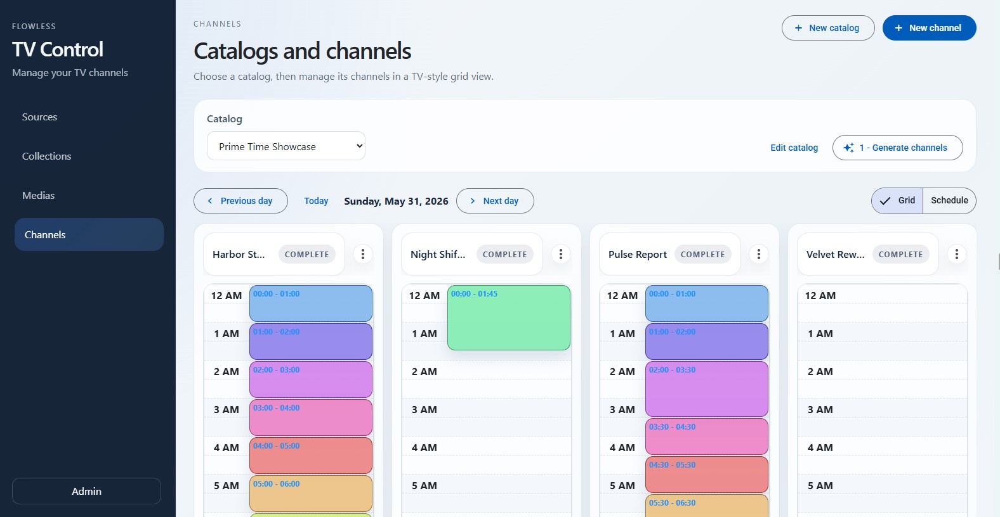
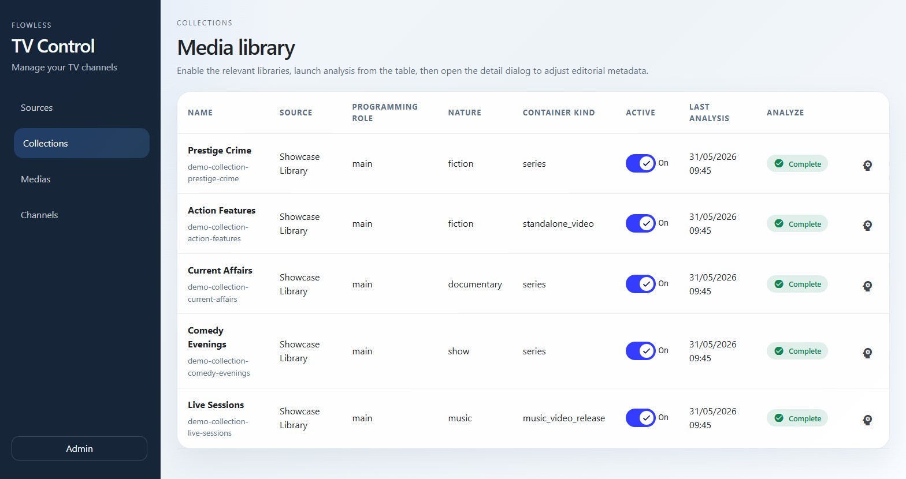
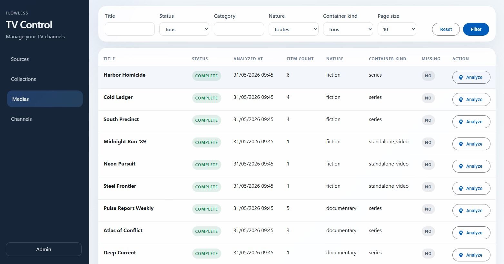
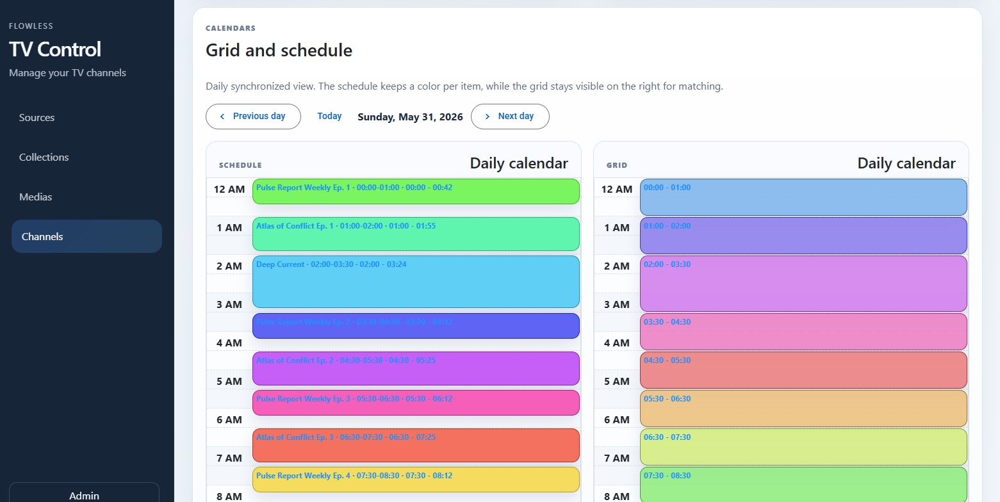

<div>

# Flowless

**Self-managed pseudo-TV channel generation from your media library**

[](https://python.org)
[](https://www.djangoproject.com/)
[](https://angular.dev/)
[](https://www.typescriptlang.org/)
[](https://www.postgresql.org/)
[](https://redis.io/)
[](https://docs.celeryq.dev/)
[](https://ersatztv.org/)


</div>

## What is it?

Flowless is an experimental app for building self-managed pseudo-TV channels from your media library.

The main idea is simple:

> “You want *this kind* of channels? I got you.”  
> “You have *this kind* of shows? I can build something with them.”

Flowless connects to your media sources, analyzes your content, builds catalogs and channels, generates programming
grids, and pushes the resulting channels and schedules to an IPTV backend such as ErsatzTV.

It acts as the brain of your IPTV setup, helping organize your TV experience automatically. 
It *does not* stream the content itself; that part is handled by ErsatzTV.

In the long term, my goal with this tool is to create a TV experience that feels close to real-world television, but fully configurable through AI and deterministic tools.
It would be something like a simulation of traditional TV, but applied to a real, usable media setup.

---

## Current status

For now, the project is mainly a playground to test ideas around media labeling, automatic channel generation, grid
planning, and integration with tools like Jellyfin and ErsatzTV.

Things may change quickly. The app may be rebuilt, simplified, broken, or redesigned at any time.

The historical process is top-down: Flowless first generates the channel structure (editorial line + grid),
then assigns media to programming blocks and builds the upcoming schedule.

A bottom-up process is now also available: Flowless analyzes the media library, segments it into programmable
segments, discovers coherent channel candidates, and lets you promote a candidate into a *flexible* channel whose
playout follows the generated segment path. New media imported later can be matched back into the existing
segments without re-running the whole analysis.

I also built other apps related to this project to make interacting with ErsatzTV easier. More coming.

The client side is mostly AI-generated. The API is too, although several sections have been manually reworked and
refined.

The categorization process uses a fixed set of categories on purpose, to keep the generated data small and predictable.
A more flexible, more expensive categorization system may be added later.

Support LLM configuration compatible with the OpenAI client library. Ollama works well with this setup.


---

## What Flowless does

Flowless can currently:

- Retrieve media from Jellyfin
- Automatically assign categories to media
    - deterministic mode
    - AI-based mode
- Create catalogs
- Create channels manually or with AI assistance
- Generate channel grids
    - fully AI-generated
    - random generation
    - AI generation based on presets
- Match media to generated programming blocks
- Schedule real trailers and fillers in post-roll windows
    - interstitial collections marked via a programming role (trailer, filler, bumper...)
    - trailers matched to upcoming programs through a provider-id folder convention
- Validate and repair generated schedules, with a per-generation report in the UI
- Program MTV-like music blocks (music genre vocabulary + built-in preset)
- Build channels bottom-up from the media library
    - segment the library into programmable segments
    - discover coherent channel candidates
    - promote a candidate into a flexible channel
    - generate flexible playouts from the segment path
    - match newly imported media to existing segments
- Generate channel logos from the channel theme (local ComfyUI or OpenAI-compatible API)
- Create channels in an IPTV app
    - currently only ErsatzTV is supported

---

## Current generation flow

### Top-down

```txt
Jellyfin media
    ↓
Media metadata import
    ↓
Automatic labeling / categorization
    ↓
Catalog creation
    ↓
Channel creation
    ↓
Grid generation
    ↓
Media matching
    ↓
ErsatzTV channel creation
```

### Bottom-up

```txt
Jellyfin media
    ↓
Media metadata import
    ↓
Automatic labeling / categorization
    ↓
Library segmentation (programmable segments)
    ↓
Channel candidate discovery
    ↓
Segment path generation
    ↓
Candidate promotion → flexible channel
    ↓
Flexible playout generation
    ↓
ErsatzTV channel creation
    ↺
New media matching into existing segments
```

---

## ToDo

- [x] **Media import**
    - [x] Retrieve media from Jellyfin
    - [x] Store media metadata locally

- [x] **Media labeling**
    - [x] Deterministic labeling
    - [x] AI-based labeling

- [x] **Catalog-level channel generation**
    - [x] Generate channels from a catalog
    - [x] Define channel intent, theme, and positioning
    - [x] Generate logo (local ComfyUI or OpenAI-compatible image API)

- [x] **Editorial line & grid generation**
    - [x] AI-based grid generation
    - [x] Random grid generation
    - [x] AI-assisted generation from presets

- [ ] **Playout generation**
  - [x] Build candidates for each programming block
  - [x] Match media to blocks based on labels, duration, type, and editorial intent
  - [x] Generate a full forward-looking playout (sliding extension for both grid modes)
  - [x] Handle fillers and fallback content (interstitial collections via programming role)
  - [ ] Handle reruns
  - [x] Validate and repair generated schedules (per-generation report, auto trim/backfill)
  - [x] Generate music programming (music genres vocabulary + MTV-like preset)
  - [x] Set trailers based on the playout (trailer of an upcoming program in post-roll windows)

- [x] **ErsatzTV synchronization**
    - [x] Create channels in ErsatzTV
    - [x] Push generated schedules to ErsatzTV

- [x] **Bottom-up channel generation**
    - [x] Analyze a media library and suggest coherent channels
    - [x] Segment the library into programmable segments
    - [x] Discover viable channel candidates from segments
    - [x] Generate a looping segment path per candidate
    - [x] Promote a candidate into a flexible channel
    - [x] Generate flexible playouts from the segment path
    - [x] Match newly imported media to existing segments
    - [x] Review / override segment memberships manually

- [x] **Layout & channel branding**
    - [x] Generate visual identity based on each channel’s theme (theme-driven logo generation)

## Quickstart

The current local setup starts from [`dev-compose.yml`](./dev-compose.yml).

1. Create a `.env.dev` file at the project root.

Example:

```dotenv
DEFAULT_ADMIN_USERNAME=admin
DEFAULT_ADMIN_EMAIL=admin@admin.local
DEFAULT_ADMIN_PASSWORD=admin

REDIS_HOST=redis
REDIS_PORT=6379

ETV_BASE_URL="http://ersatztv:8409"
ETV_API_BASE_URL="http://etv-api:8000"
ETV_API_WRAPPER_FILE_PATH="/config/scripted-schedules/wrapper.py"

USE_SQLITE=0
DB_NAME=postgres
DB_USER=postgres
DB_PASSWORD=postgres
DB_HOST=postgres
DB_PORT=5432

LLM_MODEL="qwen2.5" # I use this model with my rtx 3060 - work ok-ish for the categorization part
LLM_URL=
LLM_API_KEY="ollama"

LLM_DELAY=0
MEDIA_CONTAINER_ANALYSE_USE_LLM=1

# Logo generation (optional): "comfyui" (local GPU) or "openai" (cloud image API)
IMAGE_GENERATION_BACKEND=comfyui
COMFYUI_URL=http://192.168.1.223:8188
#OPENAI_IMAGE_API_KEY=
#OPENAI_IMAGE_MODEL=gpt-image-1

# Public entrypoint of the stack: a domain or an ip:port (no scheme).
# CORS/CSRF origins (http and https) and allowed hosts are derived from it.
DOMAIN_NAME=192.168.1.204:8004
```

2. Start the stack:

```bash
docker compose -f dev-compose.yml up --build
```

3. Access the services:

- app entrypoint: `http://localhost:8004`
- API: `http://localhost:8004/api/`
- admin: `http://localhost:8004/admin/`
- ErsatzTV: `http://localhost:8409`
- ErsatzTV API: `http://localhost:8888`


## Images

### Catalog



### Collections



### Medias



### Channel grid


